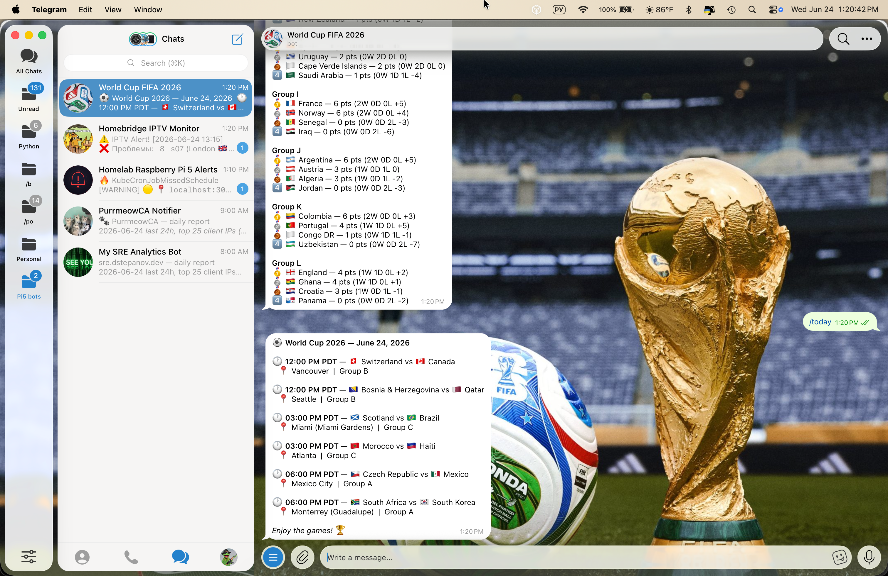
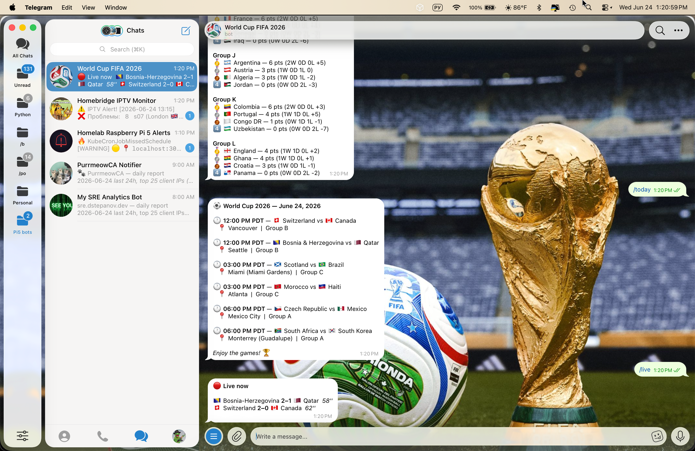
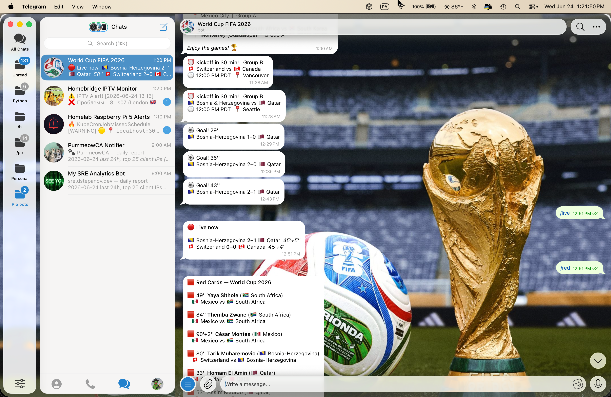
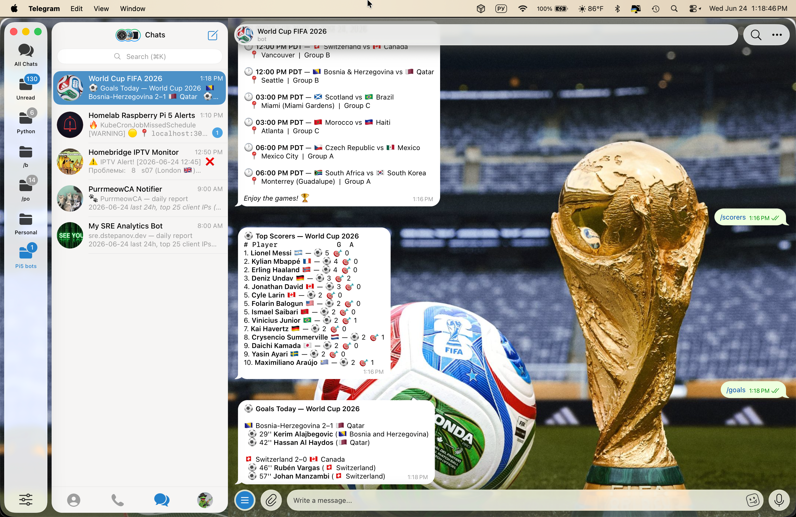
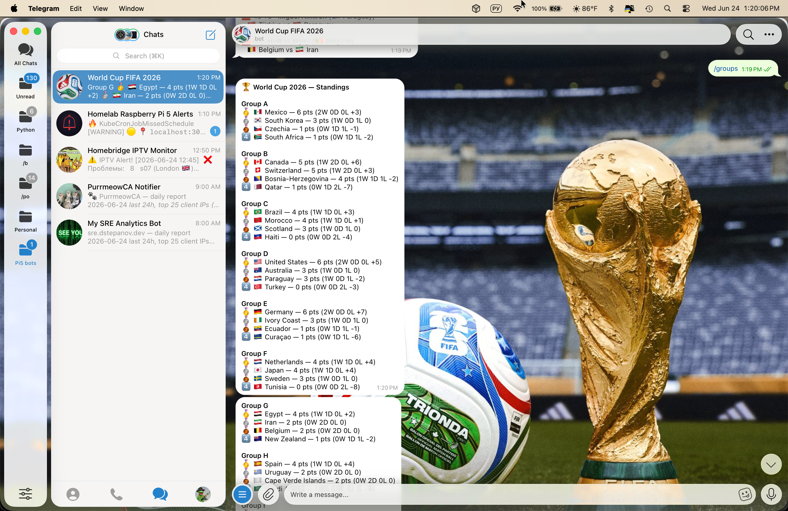
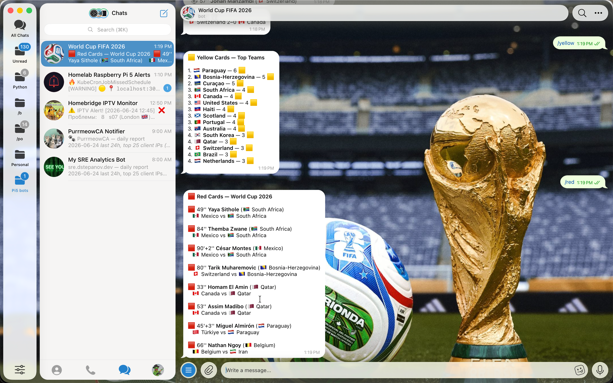

# ⚽ FIFA World Cup 2026 Telegram Bot

A real-time Telegram bot for the FIFA World Cup 2026, running on a Raspberry Pi 5 homelab.

## Features

- 📅 Today's match schedule with kickoff times
- 🔴 Live scores and goal notifications
- 🏁 Final results as soon as the whistle blows
- ⏰ Match reminders 30 minutes before kickoff
- ☀️ Morning digest with the day's matches
- 🥅 Goals feed for today's matches
- 📊 Group standings
- 🏆 Top scorers with assists
- 🟨 Yellow and red card tracking
- 🗺️ Per-user timezone (`/timezone moscow`, `/timezone minsk`, etc.)
- 🌐 English / Russian localization (`/localization ru`)
- 👥 Multi-user subscriptions for auto-notifications
- ⚡ Redis-cached API calls - 10 min TTL, so a hundred people hitting `/standings` only costs one upstream request
- 🗄️ Fully stateless - all bot state (subscribers, sent results, timezones, etc.) lives in Redis, not on local disk, so the pod can be killed and recreated at any time with zero data loss
- ☸️ Runs as a Kubernetes Deployment on a single-node k3s cluster (see [homelab-k3s](https://github.com/bibigon14/homelab-k3s))
- 🚦 Per-user rate limiting (5 commands/min) - keeps the bot polite to the upstream API when friends get spam-happy


## Screenshots

| Today's Schedule | Live Scores | Notifications |
|---|---|---|
|  |  |  |

| Top Scorers | Standings | Cards |
|---|---|---|
|  |  |  |

## Commands

| Command | Description |
|---|---|
| `/today` | Today's matches |
| `/live` | Live scores right now |
| `/schedule Germany` | Full schedule for a team |
| `/next Brazil` | Next match for a team |
| `/standings Spain` | Group table |
| `/scorers` | Top scorers of the tournament |
| `/goals` | Goals scored today |
| `/groups` | All group standings |
| `/red` | Red cards in the tournament |
| `/yellow` | Yellow cards in the tournament |
| `/team USA` | Team overview |
| `/teams` | All 48 team names |
| `/bracket` | Knockout bracket |
| `/subscribe` | Subscribe to auto-notifications |
| `/unsubscribe` | Unsubscribe |
| `/timezone moscow` | Set your timezone |
| `/localization ru` | Switch language (en/ru) |

## Data Sources

- [ESPN API](https://site.api.espn.com) - live scores, goals, key events
- [football-data.org](https://football-data.org) - standings
- [openfootball](https://github.com/openfootball/world-cup) - match schedule

## Architecture

```
Telegram ⇄ wc2026_bot.py (k3s pod) ⇄ Redis (k3s pod: cache + rate limit + state)
                  │
                  └──► football-data.org / ESPN / openfootball
```

Redis sits in front of every `football_api()` call with a 10-minute TTL, and tracks a per-`chat_id` sliding window (5 requests/min) so no single user can exhaust the bot's API quota. All bot state - subscribers, sent results, timezones, language preferences - is also stored in Redis (write-through, with a local JSON file as a backup that's only read if Redis is ever unreachable at startup). This makes the bot fully stateless from Kubernetes' point of view: no PersistentVolume needed, the pod can restart or reschedule freely.

If Redis is ever unreachable, the cache and rate limiter fail open - the bot keeps working exactly as if Redis didn't exist, just without the caching/state benefits for that session.

## Deployment

This bot runs as a Kubernetes Deployment on a single-node k3s cluster. Manifests live in [homelab-k3s/apps/wc2026bot](https://github.com/bibigon14/homelab-k3s/tree/main/apps/wc2026bot).

```bash
# build and import the image (no registry - single-node cluster)
docker build -t wc2026-telegram-bot-wc2026bot:latest .
docker save wc2026-telegram-bot-wc2026bot:latest | sudo k3s ctr images import -

# create the secret with bot credentials (one-time)
kubectl create secret generic wc2026-env --from-env-file=.env -n homelab

# deploy
kubectl apply -f /path/to/homelab-k3s/apps/wc2026bot/deployment.yaml

# after a code change, rebuild/reimport (above) then:
kubectl rollout restart deployment/wc2026bot -n homelab
```

## Local development (Docker Compose)

For local testing without touching the k3s cluster, Docker Compose still works:

```bash
git clone https://github.com/bibigon14/wc2026-telegram-bot.git
cd wc2026-telegram-bot
docker compose up --build -d
docker compose logs -f wc2026bot
```

This starts two containers: `redis` and `wc2026bot`, wired together on an internal Docker network.

Check the cache/state is working:

```bash
docker exec -it homelab-redis redis-cli KEYS "wc2026:*"
```

### Run bare-metal (alternative)

```bash
git clone https://github.com/bibigon14/wc2026-telegram-bot.git
cd wc2026-telegram-bot
pip install -r requirements.txt
python3 wc2026_bot.py
```

Without a running Redis instance the bot falls back to no-cache, no-rate-limit, file-only-state mode automatically - no extra configuration needed for a quick local test.

### Configure

Create `.env` file:

```env
BOT_TOKEN=your_telegram_bot_token
CHAT_ID=your_chat_id
FOOTBALL_API_KEY=your_football_data_api_key
SEND_TIME=08:00
CHECK_INTERVAL=5
LANG_BOT=en
```

## Privacy

The bot logs the following per command: timestamp, chat ID, Telegram username, language code. No personal data is shared or transmitted externally. Logs are stored locally on the server.

## License

MIT
